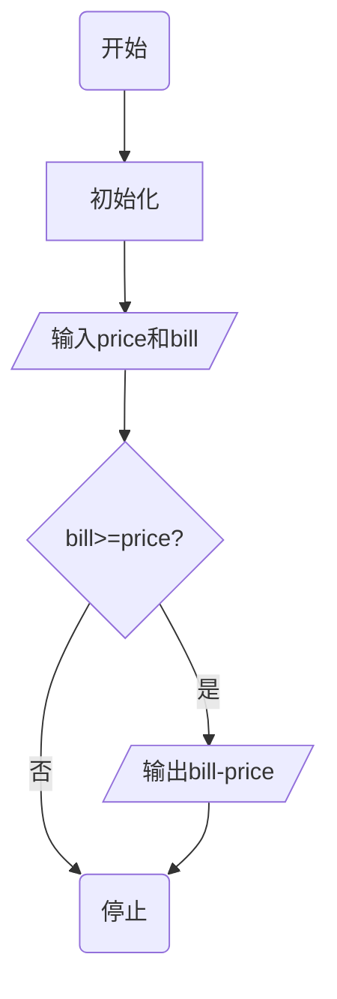
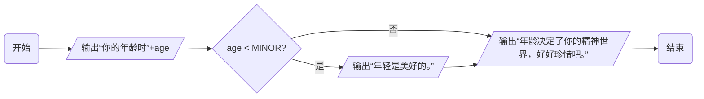
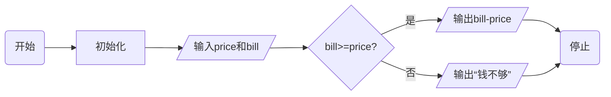

# 3.1 判断

## if

满足条件才会执行大括弧内的内的语句：

```
if( 条件成立 ) {
  ...
}
```

## 判断的条件

条件

计算两个值之间的关系，所以叫做关系运算。

|  运算符  |  意义  |
|  ---  |  ---  |
|  ==  |  相等  |
|  !=  |  不相等  |
|  >  |  大于  |
|  >=  |  大于或等于  |
|  <  |  小于  |
|  <=  |  小于或等于  |

## 关系运算的结果

当两个值的关系符合关系运算符的预期时，
关系运算的结果为整数1，否则为整数0。

```
#include <stdio.h>

int main()
{
	printf("%d\n", 5==3);
	printf("%d\n", 5>3);
	printf("%d\n", 5<=3);

	return 0;
}
```

输出结果为：

```
0
1
0
```

## 优先级

所有的关系运算符的优先级比算术运算的低，但是比
赋值运算的高。

```
例子1：
7 >= 3 + 4
例子2：
int r =a>0;
```

写成程序`test2.c`：

```
#include <stdio.h>

int main()
{
	int a = 0;		/* 变量a初始值为0 */
	
	printf("%d\n", 7>=3+4);	/* 因为7大于或等于3+4为真，所以打印1 */
	
	int r = a>0;		/* 因为a的值是0，不满足a大于0，所以r的值为0 */
	printf("%d\n", r);	/* 打印0 */

	return 0;
}
```

## 优先级（续）

判断是否相等的 `==` 和 `!=` 的优先级比其他的低，而连续的关系运
算是从左到右进行的。

```
5 > 3 == 6 > 4		/* >的优先级更高 */
6 > 5 > 4		/* 先判断6>5,为真，所以值为1。接着判断1是否>4，为假，所以值为0。 */
a == b == 6		/* 若a与b都是相等，值为1。1不与6相等，所以等式值为0 */
a == b > 0		/* >的优先级更高 */
```

## 找零计算器

- 找零计算器需要用户做两个操作：输入购买的金额，输入支付的票面，而找零计算器则
根据用户的输入来做出相应的动作：计算并打印找零，或告知用户余额不足以购买。
- 从计算机程序来看，这就是意味着程序需要读用户的两个输入，然后进行一些
计算和判断，最后输出结果。

> `// ......`这个注释是C99才有的注释。

## 注释

可以以`//`开头的语句将程序分段：

1. 初始化
2. 读入金额和票面
3. 计算并打印d找零。

## 多行注释

`/* ...... */`

## 流程图

`test3.c`:

```
#include <stdio.h>

int main()
{
	//  初始化
	int price = 0;
	int bill = 0;
	//  读入金额和票面
	printf("请输入金额：");
	scanf("%d", &price);
	printf("请输入票面：");
	scanf("%d", &bill);
	//  找零
	if ( bill >= price ) {
		printf("应该找您：%d\n", bill - price);
	}

	return 0;
}
```

流程图如下：



再看看`age.c`：

```
#include <stdio.h>

int main()
{
	const int MINOR = 35;

	int age = 0;

	printf("请输入你的年龄：");
	scanf("%d", &age);

	printf("你的年龄是%d岁。\n", age);

	if ( age < MINOR ) {
		printf("年轻时美好的，");
	}

	printf("年龄决定了你的精神世界，好好珍惜吧。\n");

	return 0;
}
```



## 否则的话

```

#include <stdio.h>

int main()
{
	//  初始化
	int price = 0;
	int bill = 0;
	//  读入金额和票面
	printf("请输入金额：");
	scanf("%d", &price);
	printf("请输入票面：");
	scanf("%d", &bill);
	//  找零
	if ( bill >= price ) {
		printf("应该找您：%d\n", bill - price);
	} else {
		printf("你的钱不够\n");
	}

	return 0;
}
```

流程图如下：



