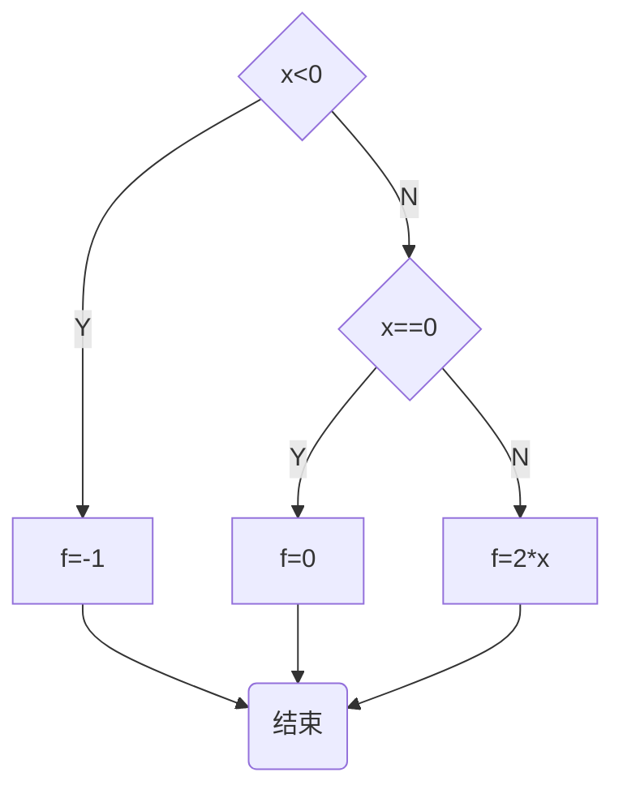

# 3.2 分支

就算每个条件要执行的语句只有1句的时候，
仍保留if语句和else语句里的大括号，能减少了别人看错程序的风险：

```
//      max3.c

#include <stdio.h>

int main()
{
        int a, b, c;
        scanf("%d %d %d", &a, &b, &c);


        int max = 0;

        if ( a>b ) {
                if ( a>c ) {
                        max = a;
                } else {
                        max = c;
                }
        } else {
                if ( b>c ) {
                        max = b;
                } else {
                        max = c;
                }
        }


        printf("The max is %d\n", max);


        return 0;
}
```

## 嵌套的判断

当if的条件满足或不满足的时候要执行的语句也可以是
一条if或if-else语句，这就是嵌套的if语句。

```
if ( code == READY )
	if ( count <20 )
		printf("一切正常\n");
	else
		printf("继续等待\n");
```

## else的匹配

在上面的代码片段中，else总和最近的那个if匹配，但是它们也都被最外面的另一个 `if ( code == READY )` 所包括。

接下来我在外面的if后面添加大括弧，同时也在里面的else前添加大括弧：

```
if ( code == READY ) {
        if ( count <20 )
                printf("一切正常\n");
} else
	printf("继续等待\n");
```

那么，此时else就会在 ` code== READY ` 不被满足的情况下执行，而与` if ( count <20 ) `不再有关系。

## 缩进

** 缩进格式不能暗示`else` 的匹配 **

```
if ( code == READY )
	if ( count <20 )
		printf("一切正常\n");
else
	printf("继续等待\n");
```

以上代码如果满足`if ( code == READY )` ，却不满足`if ( count <20 )`，
那么会执行else语句。

## 嵌套的if

```
if ( gameover == 0)
	if (player2move = 2)
printf("Your turn\n");
```

## tips

- 在if或else后面总是使用`{}`
- 即使只有一条语句的时候

## 分段函数

按条件写一段**分段函数**的程序，条件如下：

```
f(x) = -1; x<0
     = 0;  x=0
     = 2x; x>0
```

我第一次尝试写的程序，并不是分段函数：

> 第一次写的程序有一个问题，就是写了多个出口。
简称：把程序写死了。

```

//	分段函数

#include <stdio.h>

int main()
{
	int x = 0;
	scanf("%d", &x);

	if ( x < 0 ) {
		printf("f(%d) = -1\n", x);
	} else {
		if ( x == 0 ) {
			printf("f(%d) = 0\n", x);
		} else {
			printf("f(%d) = %d\n", x, 2 * x);
		}
	}

	return 0;

}
```

第二次尝试写的程序，也不是分段函数：

> 从这里开始，把程序改成了单一出口。

```

//	分段函数

#include <stdio.h>

int main()
{
	int x = 0;
	int f = 0;

	scanf("%d", &x);
	if ( x < 0 ) {
		f = -1;
	} else {
		if ( x == 0 ) {
			f = 0;
		} else {
			f = 2 * x;
		}
	}

	printf("f(%d) = %d\n", x, f);

	return 0;
}
```

课程上的新方法：`else if`，真正的分段函数：

```

//	分段函数
#include <stdio.h>

int main()
{
	int x = 0;
	int f = 0;

	scanf("%d", &x);

	if ( x < 0 ) {
		f = -1;
	} else if ( x == 0 ) {
		f = 0;
	} else {
		f = 2 * x;
	}

	printf("f(%d) = %d\n", x, f);
	
	return 0;
}
```

> 新方法出现的`else if` 本质上对应的是`if ( x > 0 )`，而最后的`else`对应的是`else if`。
这个写法可以少写一次大括号，也很有趣……

该分段函数的流程图如下：



## 级联的`if-else if`

上面的新方法就是级联，也可以写成下面的形式：

```
if ( exp1 )
	st1;
else if ( exp2 )
	st2;
else
	st3;
```

这个形式的好处是，不会随着判断条件的增加，从而让代码向内（也就是靠屏幕右边）缩进的语句越来越多。

其实我们可以用以前含有大括弧的写法来写一个有很多判断语句的程序，然后把这个程序的大括弧去掉，改成级联，最终形式会如下：

```
if ( exp1 )
	st1;
else if ( exp2 )
	st2;
else if ( exp3 )
	st3;
...
	...
else if ( exp1000 )
	st1000;
else
	st1001;
```

## if常见错误

- 忘了大括号
- if后面的分号
- 错误使用`==`和`=`
- 使人困惑的`else`

## 忘了大括号

```
if ( age >60 )
	salary = salary * 1.2;
	printf("%f", salary);
```

以上程序就算age的值不满足if，程序也会运行printf语句。更好的做法是：

```
if ( age >60 ) {
	salary = salary * 1.2;
	printf("%f", salary);
}
```

## if 后面的分号

```
if ( age > 60 );
{
	salary = salary * 1.2;
	printf("%f", salary);
}
```

该程序等同于：

```
if ( age > 60 )
	;
{
	salary = salary * 1.2;
	printf("%f", salary);
}
```

> 可以把`        ;`看作是这个程序里仅满足if语句条件时内要执行的语句，也就是什么都不做。

而：

```
{
        salary = salary * 1.2;
        printf("%f", salary);
}
```

就和普通的语句一样按顺序执行罢了（暂时忽略大括弧吧）。记住，它们都不属于if语句了。

## 错误使用 `==` 和 `=`

if只要求()里的值是零或非零

错误写法：

```
if ( a =b )
{
	printf("A=b");
}
```

课堂问答：

```
对于下面的代码：
int a=5,b=6;
if ( a=b );
printf("%d\n", a);

运行的输出是：

A.5

B.6

C.没有输出

D.0
正确答案：B你选对了
```

## warning

编译中也许出现的warning，应尽可能弄清楚为什么会出现warning，这对于学习很有帮助。

## 代码风格

最基本的要求：

- 在if和else之后必须加上大括号形成语句块；
- 打括号内的语句缩进一个tab的位置；

风格1：

```
if ( x > 0 ) {
	f = -1;
} else if ( x == 0 ) {
	f = 0;
} else {
	f = 2 * x;
}
```

风格2：

```
if ( x < 0 )
{
	f = -1;
} else if ( x == 0 )
{
	f = 0;
} else
{
	f = 2 * x;
}
```

风格3（按行分开判断条件和各自需要执行的语句，对于可以按行进行注释、删改的编辑器来说会比较方便）：

```
if ( x < 0 )
{
	f = -1;
}
else if ( x == 0 )
{
	f = 0;
}
else
{
	f = 2 * x;
}
```


