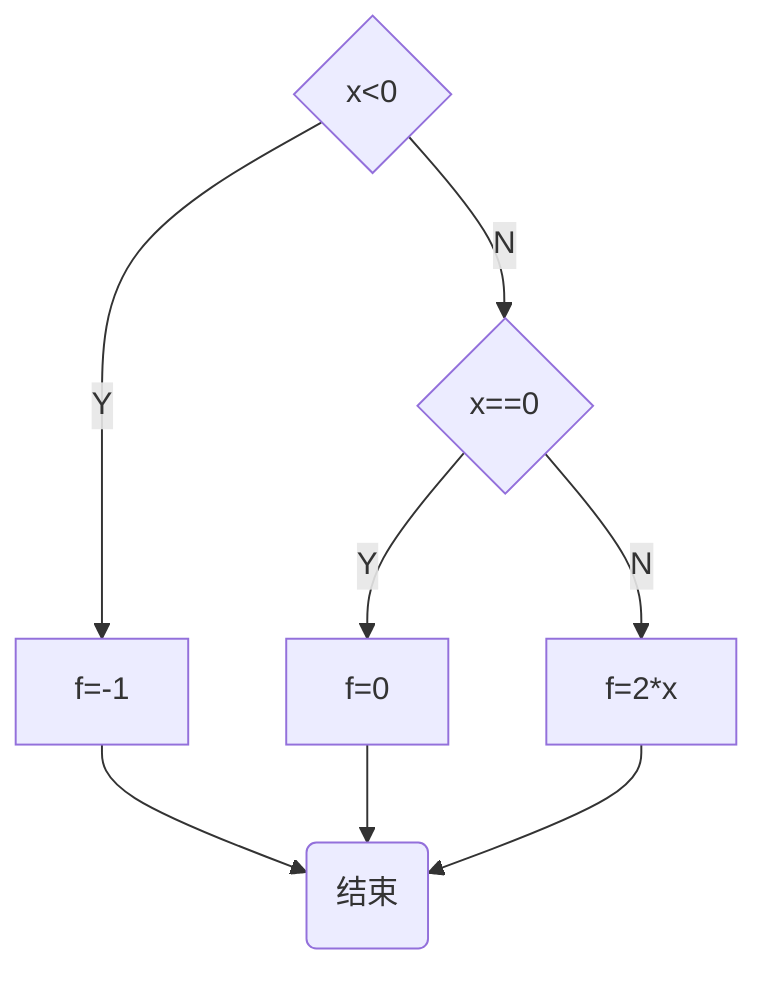

# 3.2 分支

就算每个条件要执行的语句只有1句的时候，
仍保留if语句和else语句里的大括号，能减少了别人看错程序的风险：

```
//      max3.c

#include <stdio.h>

int main()
{
        int a, b, c;
        scanf("%d %d %d", &a, &b, &c);


        int max = 0;

        if ( a>b ) {
                if ( a>c ) {
                        max = a;
                } else {
                        max = c;
                }
        } else {
                if ( b>c ) {
                        max = b;
                } else {
                        max = c;
                }
        }


        printf("The max is %d\n", max);


        return 0;
}
```

## 嵌套的判断

当if的条件满足或不满足的时候要执行的语句也可以是
一条if或if-else语句，这就是嵌套的if语句。

```
if ( code == READY )
	if ( count <20 )
		printf("一切正常\n");
	else
		printf("继续等待\n");
```

## else的匹配

在上面的代码片段中，else总和最近的那个if匹配，但是它们也都被最外面的另一个 `if ( code == READY )` 所包括。

接下来我在外面的if后面添加大括弧，同时也在里面的else前添加大括弧：

```
if ( code == READY ) {
        if ( count <20 )
                printf("一切正常\n");
} else
	printf("继续等待\n");
```

那么，此时else就会在 ` code== READY ` 不被满足的情况下执行，而与` if ( count <20 ) `不再有关系。

## 缩进

** 缩进格式不能暗示`else` 的匹配 **

```
if ( code == READY )
	if ( count <20 )
		printf("一切正常\n");
else
	printf("继续等待\n");
```

以上代码如果满足`if ( code == READY )` ，却不满足`if ( count <20 )`，
那么会执行else语句。

## 嵌套的if

```
if ( gameover == 0)
	if (player2move = 2)
printf("Your turn\n");
```

## tips

- 在if或else后面总是使用`{}`
- 即使只有一条语句的时候

## 分段函数

按条件写一段**分段函数**的程序，条件如下：

```
f(x) = -1; x<0
     = 0;  x=0
     = 2x; x>0
```

我第一次尝试写的程序，并不是分段函数：

> 第一次写的程序有一个问题，就是写了多个出口。
简称：把程序写死了。

```

//	分段函数

#include <stdio.h>

int main()
{
	int x = 0;
	scanf("%d", &x);

	if ( x < 0 ) {
		printf("f(%d) = -1\n", x);
	} else {
		if ( x == 0 ) {
			printf("f(%d) = 0\n", x);
		} else {
			printf("f(%d) = %d\n", x, 2 * x);
		}
	}

	return 0;

}
```

第二次尝试写的程序，也不是分段函数：

> 从这里开始，把程序改成了单一出口。

```

//	分段函数

#include <stdio.h>

int main()
{
	int x = 0;
	int f = 0;

	scanf("%d", &x);
	if ( x < 0 ) {
		f = -1;
	} else {
		if ( x == 0 ) {
			f = 0;
		} else {
			f = 2 * x;
		}
	}

	printf("f(%d) = %d\n", x, f);

	return 0;
}
```

课程上的新方法：`else if`，真正的分段函数：

```

//	分段函数
#include <stdio.h>

int main()
{
	int x = 0;
	int f = 0;

	scanf("%d", &x);

	if ( x < 0 ) {
		f = -1;
	} else if ( x == 0 ) {
		f = 0;
	} else {
		f = 2 * x;
	}

	printf("f(%d) = %d\n", x, f);
	
	return 0;
}
```

> 新方法出现的`else if` 本质上对应的是`if ( x > 0 )`，而最后的`else`对应的是`else if`。
这个写法可以少写一次大括号，也很有趣……

该分段函数的流程图如下：



## 级联的`if-else if`

上面的新方法就是级联，也可以写成下面的形式：

```
if ( exp1 )
	st1;
else if ( exp2 )
	st2;
else
	st3;
```

这个形式的好处是，不会随着判断条件的增加，从而让代码向内（也就是靠屏幕右边）缩进的语句越来越多。

其实我们可以用以前含有大括弧的写法来写一个有很多判断语句的程序，然后把这个程序的大括弧去掉，改成级联，最终形式会如下：

```
if ( exp1 )
	st1;
else if ( exp2 )
	st2;
else if ( exp3 )
	st3;
...
	...
else if ( exp1000 )
	st1000;
else
	st1001;
```

## if常见错误

- 忘了大括号
- if后面的分号
- 错误使用`==`和`=`
- 使人困惑的`else`

## 忘了大括号

```
if ( age >60 )
	salary = salary * 1.2;
	printf("%f", salary);
```

以上程序就算age的值不满足if，程序也会运行printf语句。更好的做法是：

```
if ( age >60 ) {
	salary = salary * 1.2;
	printf("%f", salary);
}
```

## if 后面的分号

```
if ( age > 60 );
{
	salary = salary * 1.2;
	printf("%f", salary);
}
```

该程序等同于：

```
if ( age > 60 )
	;
{
	salary = salary * 1.2;
	printf("%f", salary);
}
```

> 可以把`        ;`看作是这个程序里仅满足if语句条件时内要执行的语句，也就是什么都不做。

而：

```
{
        salary = salary * 1.2;
        printf("%f", salary);
}
```

就和普通的语句一样按顺序执行罢了（暂时忽略大括弧吧）。记住，它们都不属于if语句了。

## 错误使用 `==` 和 `=`

if只要求()里的值是零或非零

错误写法：

```
if ( a =b )
{
	printf("A=b");
}
```

课堂问答：

```
对于下面的代码：
int a=5,b=6;
if ( a=b );
printf("%d\n", a);

运行的输出是：

A.5

B.6

C.没有输出

D.0
正确答案：B你选对了
```

## warning

编译中也许出现的warning，应尽可能弄清楚为什么会出现warning，这对于学习很有帮助。

## 代码风格

最基本的要求：

- 在if和else之后必须加上大括号形成语句块；
- 打括号内的语句缩进一个tab的位置；

风格1：

```
if ( x > 0 ) {
	f = -1;
} else if ( x == 0 ) {
	f = 0;
} else {
	f = 2 * x;
}
```

风格2：

```
if ( x < 0 )
{
	f = -1;
} else if ( x == 0 )
{
	f = 0;
} else
{
	f = 2 * x;
}
```

风格3（按行分开判断条件和各自需要执行的语句）：

> 这样写的好处：对于可以按行进行批量注释或删改的编辑器来说，
会方便很多。不用担心影响到其他判断条件的代码。

```
if ( x < 0 )
{
	f = -1;
}
else if ( x == 0 )
{
	f = 0;
}
else
{
	f = 2 * x;
}
```

## 多路分支

我们现在学到的if else语句：

```
if ( type == 1 )
	printf("你好");
else if ( type == 2 )
	printf("早上好");
else if ( type == ...... )
	printf("再见");
else
	printf("啊，什么啊？");
```

可以写成`switch-case` ：

注意：`type` 可以是**表达式**（那么case所代表的结果需要与表达式的结果匹配），也可以是一个**变量**。

```
switch ( type ) {
case 1:
	printf("你好");
	break;
case 2:
	printf("早上好");
	break;
case 1000:
	printf("再见");
	break;
default:
	printf("啊，什么啊？");
	break;
}
```

> 调试时会发现，如果条件不满足任何一个if和else的判断，那么程序在运行的时候还是按照
以下顺序进行跳转：

```
if --> else if --> else if --> else --> ...
```

> 但是调试switch-case时候会发现，如果type 的值既不是1、2、...、1000，那么运行顺序如下：

```
switch --> default --> printf --> break --> return 0
```

switch-case 语法格式：

```
switch ( 控制表达式 ) {
case 常量:
	语句
	......
case 常量:
	语句
	......
default:
	语句
	......
}
```


- 控制表达式只能是整数型的结果
- 常量可以是常数，也可以是常数计算的表达式

例子1：

```
int main()
{
	int type;		/* type类型只能是int，不能用double */

	......
	
	switch ( type ) {
...
	}
	
	return 0;
}
```

例子2：

```
#include4 <stdio.h>

int main()
{
	const int MRN = 2;	/* 对应case MRN （提示：C99专有）*/	
	int type;

	scanf......

	switch ( type ) {
	case 1:
		printf...;
		break;
	case 1+1+6:		/* 完全可以这么写 */
		printf...;
		break;
	case MRN:		/* 对应const int MRN = 2; （提示：C99专有）*/
		printf...;
		break;
	...
	}
	
	return 0;
}
```

## break

> switch语句可以看作是一种基于计算的跳转，计算控制表达式的值后，
程序会跳转到相匹配的case（分支标号）处。
分支标号知识说明switch内部位置的路标，在执行完分支中的最后一条语句后，
如果后面没有break，就会顺序执行到下面的case里去，直到遇到下一个break，
或者switch结束为止。

例子：

```
switch ( type )
{
case 1:
case 2:
	printf("你好\n");
	break;
case 3:
	printf("晚上好\n");
default:
	printf...
	break...
}
```

> 如果type ==1，那么执行顺序是：
`switch --> case 1:--> 空内容 --> case 2: --> printf("你好\n"); --> break; -->return 0`

## try

以下条件是否可以用switch-case来编写程序？

```
f(x) = -1; x<0
     = 0; x=0
     = 2x; x>0
```

第一次尝试写：

```
#include <stdio.h>

int main()
{
	int x = 0;
	int f = 0;

	scanf("%d", &x);

	switch ( x ) {
	case x<0:
		f = -1;
		break;
	case x=0:
		f = 0;
		break;
	case default:
		f = 2 * x;
		break;
	}

	printf("f(%d) = %d\n", x, f);
	
	return 0;
}
```

报错：

```
$ gcc test.c
test.c: In function ‘main’:
test.c:11:9: error: case label does not reduce to an integer constant
         case x<0:
         ^~~~
test.c:14:9: error: case label does not reduce to an integer constant
         case x=0:
         ^~~~
test.c:17:14: error: expected expression before ‘default’
         case default:
              ^~~~~~~
```

第二次尝试写，可以编译成功并运行：

```

//	try.c

#include <stdio.h>

int main()
{
        int x = 0;
        int f = 0;

        scanf("%d", &x);

        switch ( x < 0 ) {
		case 1:
			f = -1;
			break;
		default:
			switch ( x == 0 ) {
				case 1:
					f = 0;
					break;
				default:
					f = 2 * x;
					break;
			}
        }

        printf("f(%d) = %d\n", x, f);

        return 0;
}
```

