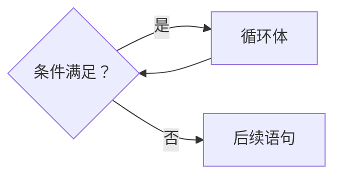
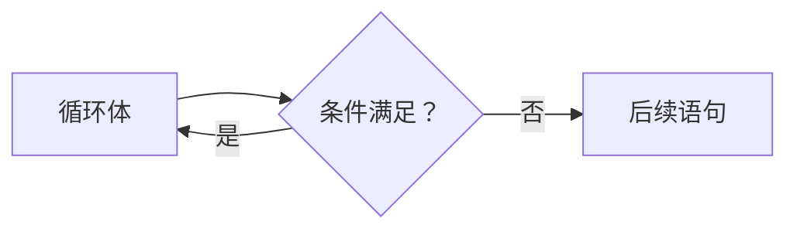
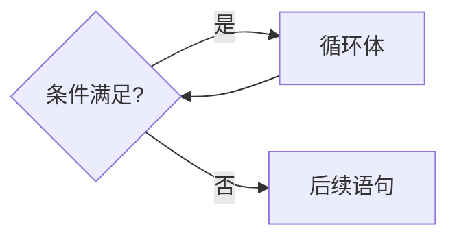

# 循环

计算几位数：

第一次用if-else：

```

//	analysis_digits.c

#include <stdio.h>

int main()
{
	int a = 0;
	int digits = 0;

	scanf("%d", &a);

	if ( a > 999 ) {
		digits = 4;
	} else if ( a > 99 ) {
		digits = 3;
	} else if ( a > 9 ) {
		digits = 2;
	} else {
		digits = 1;
	}

	printf("digits = %d\n", digits);
	return 0;
}
```

第二次尝试用switch-case写：

```

//	analysis_digits2.c
//	switch-case

#include <stdio.h>

int main()
{
	int a = 0;
	int digits = 0;

	scanf("%d", &a);
	
	switch ( a > 999 ) {
	case 1:
		digits = 4;
		break;
	default:
		switch ( a > 99 ) {
		case 1:
			digits = 3;
			break;
		default:
			switch ( a > 9) {
			case 1:
				digits = 2;
				break;
			default:
				digits = 1;
				break;
			}
		}
	}

	printf("%d\n", digits);
	
	return 0;
}

```

## 人vs计算机

- 人的方式：用眼睛看
	- `352 --> 3位`
- 计算机的方式：判断数的范围来决定它的位数
	- `352∈[100,999] --> 3位`
	- 人对数字的计算能力比文字弱

## 程序实现

- 题目明确了4位数及以下的正整数，所以可以简化一些判断。

- 因为从高处往下判断，所以不需要判断上限了。

```

//	analysis_digits_teacher.c

#include <stdio.h>

int main()
{
	int x;
	int n = 1;

	scanf("%d", &x);
	
	if ( x > 999 ) {
		n = 4;
	} else if ( x > 99 ) {
		n = 3;
	} else if ( x > 9) {
		n = 2;
	}

	printf("%d\n", n);
	
	return 0;
}
```

问题：任何范围的正整数怎么办？

## 换个方式想

```

//	analysis_digits_cross_out.c
//
//	Analysis Digits
//	Each time the rightmost digit is crossed out,
//	it is counted until no more digits are crossed out.

#include <stdio.h>

int main()
{
	int x;
	int n = 0;

	scanf("%d", &x);
	
	n++;			/* 给n+1，该表达式的值是n原来的值 */
	x /= 10;		/* 使用复合赋值，也就是x = x / 10 */
	if ( x > 0 ) {
		n++;
		x /= 10;
		if ( > 0 ) {
			n++;
			x /= 10;
			if ...
		}
	}

	printf("%d\n", n);

	return 0;
}
```

这个方法还是很繁琐，如果需要数数的位数足够大，就需要一直写重复的代码。

更好的方法是用while：

```

//	analysis_digits_cross_out.c
//
//	Analysis Digits
//	Each time the rightmost digit is crossed out,
//	it is counted until no more digits are crossed out.

#include <stdio.h>

int main()
{
	int x;
	int n = 0;

	scanf("%d", &x);
	
	n++;			/* 给n+1，该表达式的值是n原来的值 */
	x /= 10;		/* 使用复合赋值，也就是x = x / 10 */
	while ( x > 0 ) {
		n++;
		x /= 10;
	}

	printf("%d\n", n);

	
	return 0;
}
```

不过目前还是不能计算很多位数的整数的位数。

## while 循环

一个while的语句：

```
while ( x > 0 ) {
	x /= 10;
	n++;
}
```

流程图如下：



> 循环体内要有改变条件的机会。

while语句擅长做需要反复多次的事情。反复多次包括了：反复多次判断条件。

## while 循环

如果我们要把while翻译作“当”，那么一个while循环的意思就是：当条件满足时，
不断地重复循环体内的语句。

循环执行之前判断是否继续循环，所有有可能循环一次也没有被执行。

条件成立是循环继续的条件。

## 思考改写程序后输出结果有无变化？

原程序：

```
int x;
int n = 0;

scanf("%d", &x);

n++;
x /= 10;
while ( x > 0 ) {
	n++;
	x /= 10;
}

printf("%d\n", n);
```

改写后：

```
int x;
int n = 0;

scanf("%d", &x);

while ( x > 0 ) {
	n++;
	x /= 10;
}

printf("%d\n", n);
```

用简单纸笔或表格验证变量的值：

```
x	n
52	0
5	1
0	2

10	0
1	1
0	2
```

## 验证

- 测试程序使用边界数据，如有效范围两端的数据、特殊的倍数等；
- 个位数；
- 10；
- 0；
- 负数。

上面经过修改的程序可以数正整数，但是数不了0，但如果按源程序是可以数的……

## 调试

- 在程序适当的地方插入printf来输出变量的内容。

## do -while 循环

### 数位数的算法

1. 用户输入x；
2. 初始化n为0；
3. `x = x / 10`, 去掉个位；
4. `n ++`；
5. 如果`x>0`，回到3；
6. 否则n就是结果。

> 一开始在循环步骤5开始之前就通过步骤3和4进行处理的方法是对的。
上面的程序去掉了步骤3和4直接执行步骤5的方法其实是错误的。

当然也有更好的方法，就是do-while循环：

### do-while 循环

在进入循环的时候不做检查，而是在执行完一轮循环体的代码之后，再来检查
循环的条件是否满足，如果满足则继续下一轮循环，不满足则结束循环

```
do
{
	<循环体语句>
} while ( <循环条件> );
```

流程图如下：



> 总之，先进循环体，再判断条件就是“do-while循环”。

再来看看while循环：


