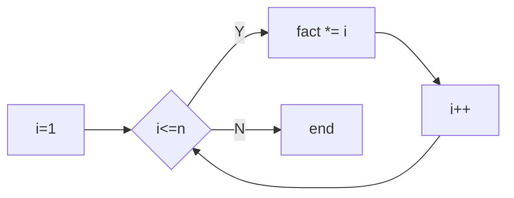

# 第三种循环——FOR循环

## 阶乘

- `n! = 1x2x3x4x...xn`
- 写一个程序，让用户输入n，然后计算输出`n!`。
- 变量：
	- 显然读用户的输入需要一个int的n，然后计算的结果需要用
一个变量保存，可以是int的factor，在计算中需要有一个变量不断地从1
递增到n，那可以是int的i


我尝试写：

```
//	factorial.c
#include <stdio.h>

int main()
{
	int n;
	int factorial = 1;
	int initial = 1;

	scanf("%d", &n);
	while ( initial < n+1) {
		factorial *= initial;
		initial = initial + 1;
	}
	printf("n = %d, factorial = %d, initial = %d\n", n, factorial, initial);

	return 0;
}
```

for语句的写法：

```
//	factorial-for.c
#include <stdio.h>
int main()
{
	int n;

	scanf("%d", &n);
	int fact = 1;

	int i = 1;
	for ( i=1; i<=n; i++ ) {
		fact *= i;
	}

	printf("%d!=%d\n", n, fact);

	return 0;
}
```

for语句圆括号的表达式：

1. 初始条件
2. 循环继续的条件
3. 循环每轮要做的动作

## for循环

for循环像一个计数循环：设定一个计数器，初始化它，
然后在计数器到达某值之前，重复执行循环体，而每执行一轮循环，
计数器值以一定步进进行调整，比如加1活减1

```
for ( i=0; i<5; i=i+1 ) {
	printf("%d", i);
}
```

## `for = 对于`

`for ( count=10; count>0; count-- )`

读作：

对于一开始的`count = 10`，当`count>0`时，重复做循环体，每一轮循环在
做完循环体内语句后，使得`count--`。

## 小套路

> 做求和的程序时，记录结果的变量应该初始化为0，而做求积的变量时，记录
结果的变量应该初始化为1

循环控制变量i只在循环里被使用了，在循环外面它没有任何用处。因此可以把变量i的定义
写到for语句里面：

```
int n;

scanf("%d", &n);
int fact = 1;

for ( int i=1; i<=n; i++ ) {
	fact *= i;
}

printf("%d!=%d\n", n, fact);
```

> 注意该方法仅C99支持。

## try

- `1*1`还是1，所以程序的循环不需要从1开始，那么改成从多少开始合适？
这样修改之后，程序对所有的n都正确吗？这样的改动有价值吗？

- 除了可以从1乘到n来计算`n!`，还可以从n乘到1来计算吧？试试吧循环
换个方向来计算n。这时候，还需要循环控制变量i吗？


还有一种写法：在循环中靠着n自减计算阶乘，但是输出结果可能需要用到变量`n_note`：

```
//	factorial-for-other.c
#include <stdio.h>
int main()
{
	int n;

	scanf("%d", &n);
	int fact = 1;
	int n_note = n;

	// int i = 1;
	for ( ; n>1; n-- ) {
		fact *= n;
		printf("n=%d, fact=%d\n", n, fact);
	}

	printf("%d!=%d\n", n_note, fact);

	return 0;
}
```

因为这里的初始条件是`n=n;`，所以我可以省略，所以for语句的括号里是：`for ( ; n>1; n-- )`。

## 循环的计算和选择

### 循环次数

当我们这么写`for ( i=0; i<n; i++`，

则循环的次数是`n`，而循环结束后`i`的值是`n`。

循环的控制变量`i`，是选择从`0`开始还是从`1`开始，是判断`i<n`还是判断`i<=n`，
对循环的次数，循环结束后变量的值都有影响。

## `for == while`

以下两种循环是等价的：

for循环：

```
for ( int i=1; i<=n; i++ ) {
	fact *= i;
}
```

while循环：

```
int i =1;
while ( i<=n ) {
	fact *= i;
	i++;
}
```

流程图如下：



### for 循环

```
for ( 初始动作; 条件; 每轮的动作 ) {
}
```

> for中的每一个表达式都是可以省略的。

```
for (; 条件; ) == while ( 条件 )
```

## Tips for loops

- 如果有固定次数，用for
- 如果必须执行一次，用`do_while`
- 其他情况用`while`
