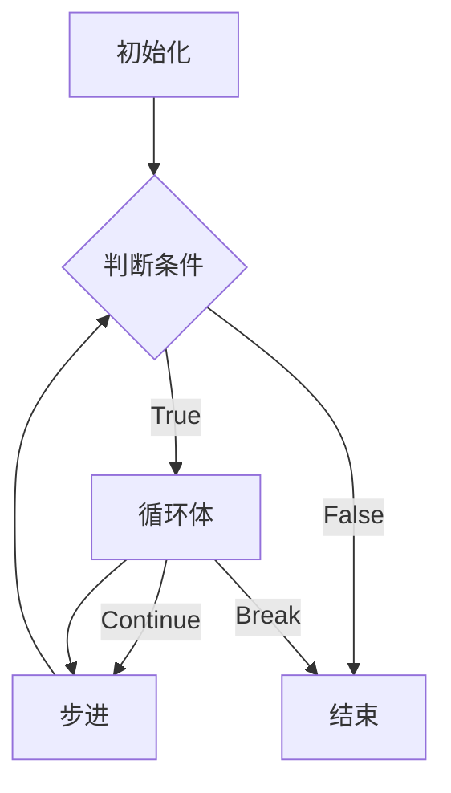

# 5.2循环控制

## 素数

只能被1和自己整除的数，不包括1
如：2 3 5 7 11 13 17 19 ...

```
//	prime.c
#include <stdio.h>
int main()
{
	int x;
	scanf("%d", &x);

	int i ;
	int isPrime = 1;	/* x是素数？ */
	for ( i=2; i<x; i++ ) {
		if ( x % i == 0 ) {
			isPrime = 0;
			break;		/* 一旦有一次isPrime = 0，就可以break跳出循环 */
		}
	}
	if ( isPrime == 1 ) {
		printf("是素数\n");
	} else {
		printf("不是素数\n");
	}


	return 0;
}
```

## break vs continue

break：跳出循环

continue：跳过循环这一轮剩下的语句进入下一轮

例子：

```

int x = 9;
int i;
int isPrime = 1;
for ( i=2; i<x; i++ ) {
	if ( x % i == 0 ) {
		isPrime = 0;
		continue;
	}
	print(%d\n", i);

```

当i=2，if判断条件不满足，直接执行printf，回到for循环

接着i=3，if判断条件满足，且执行了continue，于是printf被跳过，回到for循环

流程图如下：



## 嵌套的循环

如何写程序输出100以内的素数？

在`prime.c`的基础上修改，使之输出100以内的素数，`prime-100.c` ：

```

//	prime-100.c
#include <stdio.h>
int main()
{
	int x;
	// scanf("%d", &x);
	
	for ( x=1; x<=100; x++ ) {
		int i ;
		int isPrime = 1;	/* x是素数？ */
		for ( i=2; i<x; i++ ) {
			if ( x % i == 0 ) {
				isPrime = 0;
				break;		/* 一旦有一次isPrime = 0，就可以break跳出循环 */
			}
		}
		if ( isPrime == 1 ) {
			printf("%d ", x);

		} 
	}

	return 0;
}
```

> 我们在for循环里还有一个for循环，这就是嵌套的循环！

对了，通常情况下，每一层循环用的控制变量应该是不一样的（比如第一层for的控制变量是
x，第二层for的控制变量是i）。如果是特殊设计下需要让两层循环的控制变量相同，不属于这里
讨论的情况。

接着，我们改变问题，如果要求前五十个素数呢？前提是我们不知道前五十个素数是多大的数字。
所以我们并不清楚结束的地方。

思路解析：因为要算“前五十个”，所以涉及到数数，所以需要一个计数器。

最终程序如下：

```

//	prime-50-while.c
#include <stdio.h>
int main()
{
	int x;
	int cnt = 0;			/* 计数器 */
	// scanf("%d", &x);
	
	// for ( x=1; cnt<50; x++ ) {	/* cnt计数满50次即可结束循环 */
		
	x = 1;
	while ( cnt < 50) {
		int i ;
		int isPrime = 1;	/* x是素数？ */
		for ( i=2; i<x; i++ ) {
			if ( x % i == 0 ) {
				isPrime = 0;
				break;		/* 一旦有一次isPrime = 0，就可以break跳出循环 */
			}
		}
		if ( isPrime == 1 ) {
			cnt ++;		/* 计数器开始计数 */
			printf("%d\t", x);	/* 反斜杠t用于对齐输出结果 */

			if ( cnt %5 == 0 ) {
				printf("\n");	/* 当程序每输出五个素数后，便会打印一次换行符号 */
			}

		}
		x++;
	}

	return 0;
}
```

该程序输出结果如下：

```
1       2       3       5       7
11      13      17      19      23
29      31      37      41      43
47      53      59      61      67
71      73      79      83      89
97      101     103     107     109
113     127     131     137     139
149     151     157     163     167
173     179     181     191     193
197     199     211     223     227
```


