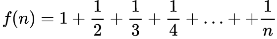
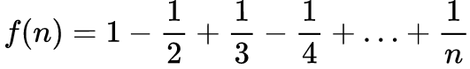

# 5.3 循环应用

## 求和

求以下等式：



程序`file1.c`：

```
#include <stdio.h>
int main()
{
	int n;
	int i;
	double sum = 0;

	// scanf("%d", &n);
	n = 10;
	for ( i = 1; i<=n; i++ ) {
		sum += 1.0/i;
	}

	printf("f(%d)=%f\n", n, sum);

	return 0;
}
```

接下来看看另一个等式：



#include <stdio.h>
int main()
{
	int n;
	int i;
	double sum = 0;
	int sign = 1;

	// scanf("%d", &n);
	n = 1000;
	for ( i = 1; i<=n; i++ ) {
		sum += sign*1.0/i;
		sign = -sign;
	}

	printf("f(%d)=%f\n", n, sum);

	return 0;
}
```

我们还可以对这个程序进行优化，比如用`double sign = 1.0`代替`int sign = 1`，具体做法如下：

```
#include <stdio.h>
int main()
{
	int n;
	int i;
	double sum = 0;
	// int sign = 1;
	double sign = 1.0;

	// scanf("%d", &n);
	n = 1000;
	for ( i = 1; i<=n; i++ ) {
		sum += sign/i;
		sign = -sign;
	}

	printf("f(%d)=%f\n", n, sum);

	return 0;
}
```

## 整数分解

正序分解整数

- 输入一个非负整数，正序输出它的每一位数字
- 输人：13425
- 输出：1 3 4 2 5


